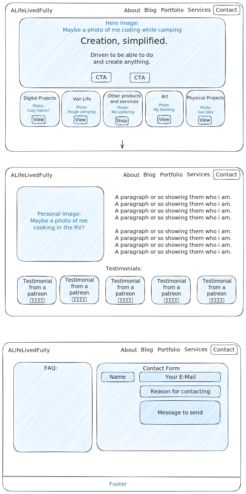

# ALifeLivedFully.com
github repository for [ALifeLivedFully.com](https://alifelivedfully.com) the personal website for the developer of the same name, [ALifeLivedFully](https://github.com/ALifeLivedFully).

## Todo
- [ ] Impliment design vision for homepage
- [ ] decide on what pages to include in the heading
- [ ] create design vision for other pages (potential pages listed below)
  - [ ] Blog: post an update once a month with a podcast, video, blog.
  - [ ] Portfolio: My cozy game, my painting, DIY Watch, etc.
  - [ ] About: short little bio
  - [ ] Skills: Git, Linux, Rust, Small engines, Laptop repair, Watch making, etc.
  - [ ] Experiences: Work history like ace hardware, Foss swim school, etc.
  - [ ] Education: 
  - [ ] Accomplishments: certifications like CNA, HHA, Tech certs, etc.
  - [ ] Achievements: eg. ran a 5K
  - [ ] News: Show my "News-worthy" things like Keiki's Dream etc
  - [ ] Notes: find a way to publish my obsidian notes into this section.
  - [ ] Gist's: exactly like the gist.github.com but self hosted
  - [ ] Repo's: exactly like my github accoount but self hosted?
  - [ ] Links: use the Hugo theme [Lynx](https://themes.gohugo.io/themes/lynx/)

## Design Vision

### Homepage

